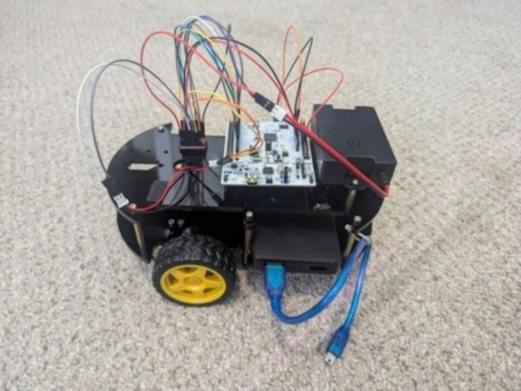
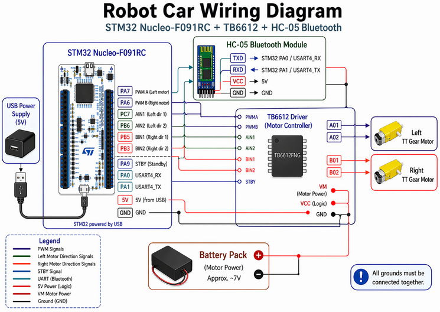
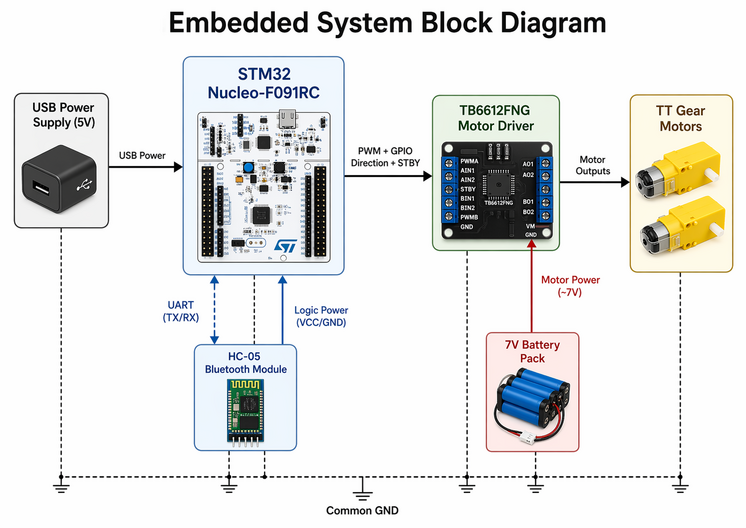

# STM32 Mobile Robot Controller

## Overview

This project implements a UART/Bluetooth-controlled mobile robot using an STM32 Nucleo board, PWM motor control, command parsing, and a communication watchdog.

The robot receives commands over Bluetooth, parses them into left/right motor commands, and drives a TB6612FNG motor driver using GPIO direction pins and TIM3 PWM outputs.

## Media

### Driving demo
<h3>
  <a href="https://www.youtube.com/watch?v=r0X5UvUqSxo">
    ▶ Watch the robot driving demo
  </a>
</h3>

### Robot build


### Wiring diagram


### Block diagram



## Features

- Interrupt-driven USART receive
- Circular buffers for UART input
- Bluetooth command input through USART4
- Debug output through USART2
- TIM3 PWM motor speed control
- GPIO motor direction control
- Fixed movement commands
- Joystick-style mixed drive commands
- Communication watchdog for safe stop behavior
- Unit tests for command parsing and robot logic
- Modular source files for board setup, USART, PWM, parsing, motor control, and timing

## Hardware

Target board:

- STM32 Nucleo-F091RC

External hardware:

- HC-05 Bluetooth module
- TB6612FNG motor driver
- Four TT gear motors
- ~7V battery pack for motor power
- USB connection for STM32 power and debug UART

## Pin Mapping

### USART

| Function | Pin | Peripheral |
|---|---:|---|
| Debug TX | PA2 | USART2_TX |
| Debug RX | PA3 | USART2_RX |
| Bluetooth TX/RX | PA0 / PA1 | USART4 |

### Motor Driver

| Function | Pin |
|---|---:|
| STBY | PA9 |
| AIN1 | PC7 |
| AIN2 | PB6 |
| BIN1 | PB5 |
| BIN2 | PB3 |
| PWMA | PA7 / TIM3_CH2 |
| PWMB | PA6 / TIM3_CH1 |


## Wiring

The robot uses an STM32 Nucleo board, one TB6612FNG motor driver, four TT gear motors, and an HC-05 Bluetooth module.

The four TT gear motors are controlled as two motor groups: left-side motors and right-side motors.

### STM32 to Motor Controller

| STM32 Pin | Connection | Purpose |
|---|---|---|
| PA7 | PWMA / left motor PWM | Left motor speed control |
| PA6 | PWMB / right motor PWM | Right motor speed control |
| PC7 | AIN1 | Left motor direction |
| PB6 | AIN2 | Left motor direction |
| PB5 | BIN1 | Right motor direction |
| PB3 | BIN2 | Right motor direction |
| PA9 | STBY | Enables motor controller |

### STM32 to HC-05 Bluetooth Module

| STM32 Pin | HC-05 Pin | Purpose |
|---|---|---|
| PA0 | TXD | USART4 RX from Bluetooth |
| PA1 | RXD | USART4 TX to Bluetooth |
| 5V | VCC | Bluetooth power |
| GND | GND | Common ground |

### Power

- The STM32 Nucleo board is powered through USB.
- The TB6612FNG motor driver receives motor power from an external ~7V battery pack.
- All grounds are connected together.
- The TB6612FNG `STBY` pin must be driven high before the motors will run.

## Software Architecture

### `main.c`

Initializes the board, UARTs, PWM, motor controller, and SysTick timer. The main loop waits for Bluetooth commands, processes valid commands, and triggers a safe stop if no valid command is received before the watchdog timeout expires.

### `board.c`

Configures GPIO clocks and motor-control GPIO pins. It also places motor-control pins into a safe LOW state during initialization.

### `usart.c`

Configures USART2 for debug communication and USART4 for Bluetooth input. Receive interrupts place incoming bytes into circular buffers so the main loop can process commands without polling the USART hardware directly.

### `cbfifo.c`

Implements a fixed-size circular byte FIFO. Interrupt masking is used during enqueue and dequeue operations to protect shared buffer state between interrupt handlers and foreground code.

### `tim3_pwm.c`

Configures TIM3 PWM outputs on PA6 and PA7. These PWM outputs control motor speed through the TB6612FNG motor driver.

### `motor_control.c`

Converts high-level motor directions and PWM values into GPIO direction settings and TIM3 compare values. This module provides the main motor-control interface used by the command parser.

### `parse_cmd.c`

Parses received command strings into `drive_command_t` values. It supports both fixed commands and joystick-style commands.

### `systick_timer.c`

Provides a simple tick-based timing interface used by the communication watchdog.

## Usage

The robot can be controlled in two ways:

### 1. Joystick Control (Recommended)

Use the **BT Car Controller** mobile app to send joystick-style commands over Bluetooth.

The HC-05 is connected to USART4, and the app sends joystick command strings that are parsed by `parse_cmd.c`.

### 2. Manual Commands

Manual commands can be sent over Bluetooth or through the debug UART. See the Command Format section below for the supported command characters.

## Command Format

### Fixed Commands

| Command | Behavior |
|---|---|
| `w` | Move forward |
| `s` | Move backward |
| `a` / `l` | Turn left |
| `d` / `r` | Turn right |
| `q` | Brake stop |
| `e` | Coast stop |

### Joystick Commands

Joystick commands encode throttle and turn values.

These commands were designed to be compatible with the **BT Car Controller** mobile app, which was used to control the robot and define the joystick command format over Bluetooth.

Example:

```text
f50r20
```

This means:

- forward throttle magnitude = 50
- right turn magnitude = 20

The parser converts throttle and turn into left/right motor commands using differential drive mixing:

```text
left  = throttle + turn
right = throttle - turn
```

The resulting values are clamped before being sent to the motor controller.

## Safety Behavior

The main loop includes a communication watchdog. If no valid Bluetooth command is received within the timeout window, the robot calls `brake_stop()` and remains stopped until a new valid command is received.

This prevents the robot from continuing to move if Bluetooth communication drops or the controller stops sending commands.

## Build and Flash Instructions

This project was developed in STM32CubeIDE for the STM32 Nucleo-F091RC.

To build and flash the project:

1. Open the project in STM32CubeIDE.
2. Connect the STM32 Nucleo-F091RC over USB.
3. Build the project.
4. Flash the project to the board using the STM32CubeIDE debug/run configuration.

Debug output is sent over USART2 through the Nucleo USB connection. Bluetooth commands are received through USART4 from the HC-05 module.

## Testing

This project uses a combination of automated host-side tests and manual hardware validation.

The automated tests focus on command parsing and robot-drive logic that can be verified without the STM32 board. Hardware-facing behavior, such as PWM output, GPIO motor direction, Bluetooth communication, and watchdog stop behavior, is verified through manual integration tests on the robot.

The full testing plan is documented in:
TESTING_STRATEGY.md


## Notes

This project uses direct register access through CMSIS device headers rather than HAL. This keeps the code close to the hardware and makes the peripheral configuration explicit.